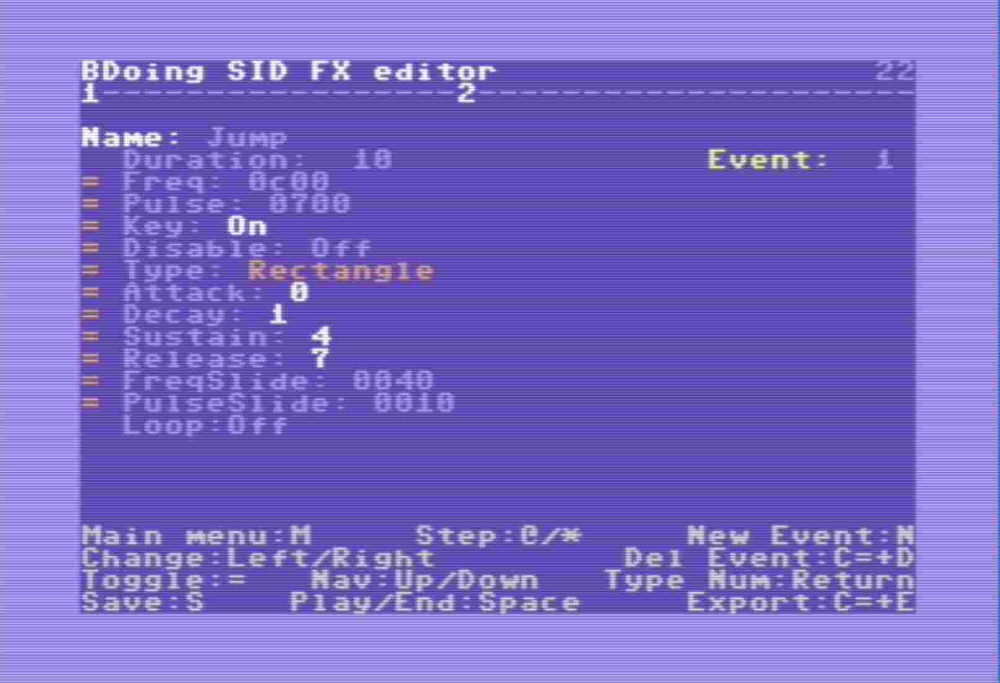

# BDoing Sound Effect Tool for C64/SID

The SID chip is easy enough to use that you can easily hardcode sound
effects by just creating the parameters in an array and copy
that in to the hardware registers for a channel. Unfortunately I don't
have a good intuition for sounds so I made a tool I could use for
this simple task.

For more details about the SID chip please review
https://www.c64-wiki.com/wiki/SID

The tool will export source code of bytes to copy to the SID
registers, it will not handle channel allocation or anything
else that might interfere with other audio systems.
It does add some nice features like timing, looping and
sliding (for frequency and pulse).

Each sound is stored as a sequence of events. An event is any
time a channel register should change, such as key on and
key off.

# Building BDoing

BDoing is intended to be assembled with the [x65 assembler](https://github.com/Sakrac/x65)

    x65 src\bdoing.s bdoing.prg

# Starting BDoing

The tool runs on a Commodore 64 as a prg file and expects to be
loaded from a floppy (d64 or SDIEC). The first screen is a directory
listing of the floppy, and using cursor up/down you can select an
existing sound file or press '=' to create a new file. If you select
a file that is not a sound the directory listing screen will refresh.
If you create a new file the tool will ask for a new filename and
then a new sound name.

As an example to work with Vice look at run.bat. This file expects
to find Vice x64 and c1541 in \\Vice\\.

# File Menu Controls

* Up / Down (Shift+Down / Down): Navigate Files
* Return: Load the selected file
* =: Create a new file

# Sound Bank

The sound bank is the list of sounds in a sound file. The sound bank
screen lets you test sounds by pressing A-W, and if a sound is
looping press 1-3 (based on which channel is playing) to end the
loop. Press '=' to create a new sound, followed by typing a name
for the sound. Use up/down to navigate and  Return to edit a sound.

* A-W: Test sound
* 1-3: Stop loop in channel 1-3
* Up / Down (Shift+Down / Down): Navigate sounds
* Return: Edit the selected sound
* =: Create a new sound

# Sound Edit

Edit a sound one event at a time in the Edit screen, where
each event is made up of registers like frequency, pulse,
ADSR, control, frequency slide and pulse slide. In addition
to the sound registers there is also loop control and
event duration that can be edited.
If a sound register is not enabled, it won't be written
to hardware when the event happens so events that don't
do much, such as key off, end up very small. Exporting extra
labels will enable customizing sound events runtime in
the code that plays sound effects.

Sound editing is live so anything that is modified while a
sound is playing will be reflected even if the sound has already started.

* =: Toggle a sound register for this event (indicated in leftmost column)
* L: Toggle label for this event (indicated in column 2)
* Space: Play a sound, end loop if sound is already playing.
* Up / Down (Shift+Down / Down): Navigate registers in Sound Event
* Left / Right (Shift+Right / Right): Adjust values lesser/greater
* C= + Left/Right: Adjust high byte of 2 byte values (freq. etc.)
* Return: Start typing in a number for a sound register, duration or name
* N: New event (inserted after current event)
* C= + D: Delete event
* @/*: Go back/forward between sound events
* S: Save all sounds in bank
* C= + E: Export source code for all sound data in bank

# Data format details

The exported data is very simple, each event is saved starting
with a frame count until the next event, then a mask byte that
contains:

* \$01 - Frequency
* \$02 - Pulse
* \$04 - Attack / Decay
* \$08 - Sustain / Release
* \$10 - Control
* \$20 - Frequency Slide
* \$40 - Pulse Slide

For each bit in the mask byte the data follows in the same
order.

If the frame count is 0 the sound is done, and if it is
negative it is a loop point, or -bytes to step back to
restart the loop.

Exported data sample

    BDoing_SND:
	    dc.b $03, $1f, $00, $0a, $f8, $07, $12, $c1, $21
	    dc.b $03, $10, $20
	    dc.b $0b, $7f, $00, $0c, $00, $08, $23, $89, $41, $00, $02, $a0, $ff
	    dc.b $0b, $30, $40, $00, $02
	    dc.b $00

# Extra Export Labels (hit 'L' in sound edit to toggle)

I talked to a number of sound designers (because I'm not
really an expert in audio tools) about making a new sound tool.
One thing that was mentioned was that if someone was using
synthesized sounds rather than premade sounds one major benefit
would be the ability to have more procedural sounds, as in
having a simple way to modify synth parameters each time a
sound is triggered, or while it is playing. To support this
in a source format I figured the easiest way would be to
somehow bookmark useful event registers in the data so I've
added labels. As an example, imagine a looping sound such as
the sound of a chopper. By simply adjusting the duration of
the loop while the chopper loop is playing you can make it
sound as if the blades are slowing down or speeding up.

Labels will be exported as the sound name + occurence within
sound + one of:
* Duration: _DUR
* Frequency: _FRQ
* Pulse: _PLS
* Attack / Decay: _AD
* Sustain / Release: _SR
* Control: _CTL
* Frequency Slide: _FDT
* Pulse Slide: _PDT

# Playback source

BDoing_Play.s is provided as a reference implementation
to play back sounds. You're encouraged to rewrite it
but should work fine as is. See source for further
details.

# PAL and NTSC note

I initially intended to convert frequency and time steps to
NTSC automatically but wasn't happy with the automatic conversion
result. My conclusion is that the difference is not really
noticable, and if it is then it is better to manually create
the other version in an emulator.

# BDoing?

While working on Pac-Man World 2, Klonoa came out (both are
Namco games) and we copied one of the mechanics which was
a platform that shoots you up while the camera looks straight
down. This was named a BDoing platform.

# Sound workflow

To iterate on a PC with an emulator I'm using this batch file
to move sound assets on and off a d64 and move the exported
source files into another folder.

    del bdoing.d64
    \vice\c1541 -format #bdoing#,8 d64 bdoing.d64 -write BDoing.prg @8:bdoing
    for %%i in (example\*.snd) do \vice\c1541 bdoing.d64 -write %%i @8:%%~ni.snd
    \vice\x64 -remotemonitor BDoing.d64
    IF EXIST tmp rmdir /S /Q tmp
    mkdir tmp
    cd tmp
    dir ..\bdoing.d64
    \vice\c1541 ..\bdoing.d64 -extract
    cd ..
    dir tmp
    move /Y tmp\*.snd example
    IF EXIST tmp\*.s move /Y tmp\*.s example
    rmdir /S /Q tmp

